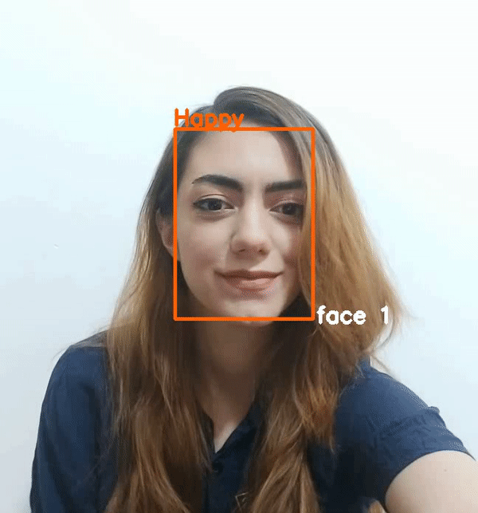
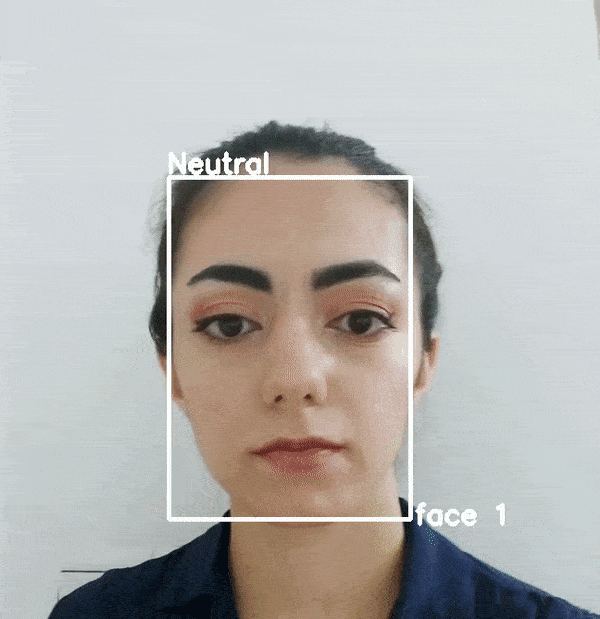
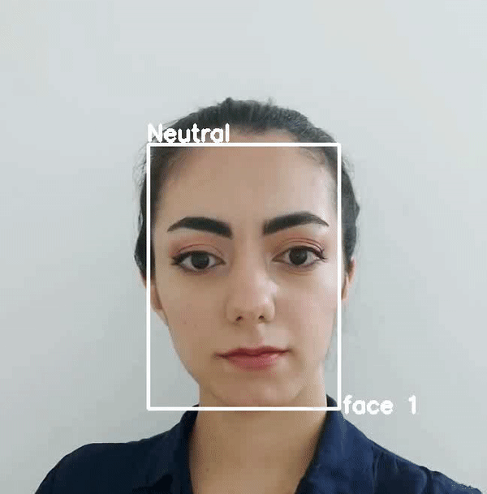

training a deep network on AffectNet database in both regression (dimensional) and categorical (Paul Ekman emotion's model).

the EfficientNet b0 architecture was used.

as affectnet author menshioned, the evaluation data was based on validation set.

here is some sample from affect detection in both categorical and dimensional:

