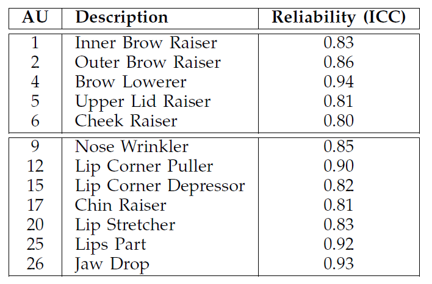
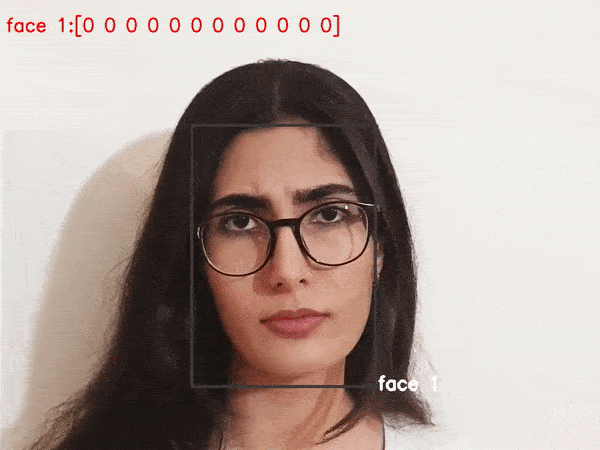

this is a AU detection project in DISFA+ dataset.
first of all i preprocessed disfa dataset and then saving those in tfrecords format.
next loaded a pre trained FER model and removed top head (dnn) from it. after that i finetuned new data on it to predict 12 AUs.

details of AUs based on DISFA+ paper.

here are some example (AUs level showed in ascending order from left to right)

